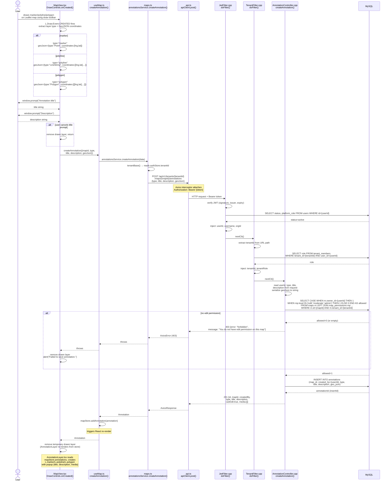

# Flow: Create Annotation on a Map

```mermaid
sequenceDiagram
    actor User
    participant LF as MapView.tsx<br/>DrawControls.onCreated()
    participant UM as useMap.ts<br/>createAnnotation()
    participant AS as maps.ts<br/>annotationsService.createAnnotation()
    participant AX as api.ts<br/>apiClient.post()
    participant JF as JwtFilter.cpp<br/>doFilter()
    participant TF as TenantFilter.cpp<br/>doFilter()
    participant AN as AnnotationController.cpp<br/>createAnnotation()
    participant DB as MySQL

    User->>LF: draws marker/polyline/polygon<br/>on Leaflet map using draw toolbar
    LF->>LF: L.Draw.Event.CREATED fires<br/>extract layer type + GeoJSON coordinates

    alt marker
        LF->>LF: type="marker"<br/>geoJson={type:"Point", coordinates:[lng,lat]}
    else polyline
        LF->>LF: type="polyline"<br/>geoJson={type:"LineString", coordinates:[[lng,lat],...]}
    else polygon
        LF->>LF: type="polygon"<br/>geoJson={type:"Polygon", coordinates:[[[lng,lat],...]]}
    end

    LF->>User: window.prompt("Annotation title")
    User-->>LF: title string
    LF->>User: window.prompt("Description")
    User-->>LF: description string

    alt user cancels title prompt
        LF->>LF: remove drawn layer, return
    end

    LF->>UM: createAnnotation({mapId, type,<br/>title, description, geoJson})
    UM->>AS: annotationsService.createAnnotation(data)
    AS->>AS: tenantBase() → reads authStore.tenantId
    AS->>AX: POST /api/v1/tenants/{tenantId}<br/>/maps/{mapId}/annotations<br/>{type, title, description, geoJson}

    Note over AX: Axios interceptor attaches<br/>Authorization: Bearer {token}

    AX->>JF: HTTP request + Bearer token
    JF->>JF: verify JWT (signature, issuer, expiry)
    JF->>DB: SELECT status, platform_role FROM users WHERE id={userId}
    DB-->>JF: status=active
    JF->>JF: inject: userId, username, orgId
    JF->>TF: nextCb()

    TF->>TF: extract tenantId from URL path
    TF->>DB: SELECT role FROM tenant_members<br/>WHERE tenant_id={tenantId} AND user_id={userId}
    DB-->>TF: role
    TF->>TF: inject: tenantId, tenantRole
    TF->>AN: nextCb()

    AN->>AN: read userId, type, title,<br/>description from request<br/>serialize geoJson to string

    AN->>DB: SELECT CASE WHEN m.owner_id={userId} THEN 1<br/>WHEN mp.level IN ('edit','moderate','admin') THEN 1 ELSE 0 END AS allowed<br/>FROM maps m LEFT JOIN map_permissions mp ...<br/>WHERE m.id={mapId} AND m.tenant_id={tenantId}
    alt no edit permission
        DB-->>AN: allowed=0 (or empty)
        AN-->>AX: 403 {error: "forbidden",<br/>message: "You do not have edit permission on this map"}
        AX-->>AS: AxiosError (403)
        AS-->>UM: throws
        UM-->>LF: throws
        LF->>LF: remove drawn layer<br/>alert("Failed to save annotation.")
    end
    DB-->>AN: allowed=1

    AN->>DB: INSERT INTO annotations<br/>(map_id, created_by={userId}, type,<br/>title, description, geo_json)
    DB-->>AN: annotationId (insertId)

    AN-->>AX: 201 {id, mapId, createdBy,<br/>type, title, description,<br/>canEdit:true, media:[]}
    AX-->>AS: AxiosResponse
    AS-->>UM: Annotation

    UM->>UM: mapStore.addAnnotation(annotation)
    Note over UM: triggers React re-render

    UM-->>LF: Annotation
    LF->>LF: remove temporary drawn layer<br/>(AnnotationLayer re-renders from store)

    Note over LF: AnnotationLayer.tsx reads<br/>mapStore.annotations, creates<br/>L.marker/L.polyline/L.polygon<br/>with popup (title, description, media)
```
