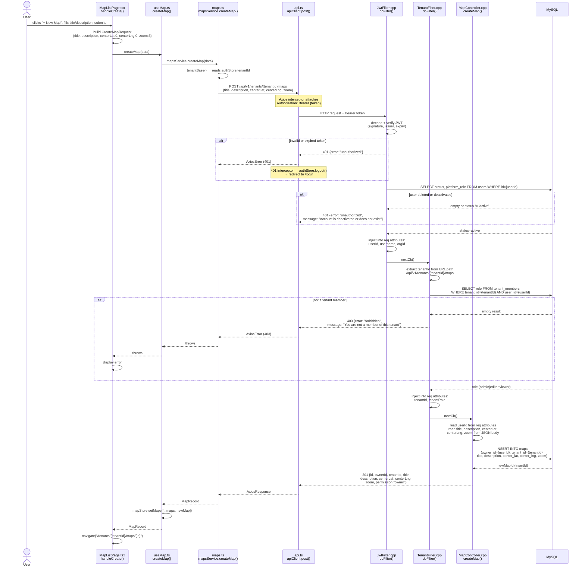

# Flow: Create Map

```mermaid
sequenceDiagram
    actor User
    participant ML as MapListPage.tsx<br/>handleCreate()
    participant UM as useMap.ts<br/>createMap()
    participant MS as maps.ts<br/>mapsService.createMap()
    participant AX as api.ts<br/>apiClient.post()
    participant JF as JwtFilter.cpp<br/>doFilter()
    participant TF as TenantFilter.cpp<br/>doFilter()
    participant MC as MapController.cpp<br/>createMap()
    participant DB as MySQL

    User->>ML: clicks "+ New Map", fills title/description, submits
    ML->>ML: build CreateMapRequest<br/>{title, description, centerLat:0, centerLng:0, zoom:3}

    ML->>UM: createMap(data)
    UM->>MS: mapsService.createMap(data)
    MS->>MS: tenantBase() → reads authStore.tenantId
    MS->>AX: POST /api/v1/tenants/{tenantId}/maps<br/>{title, description, centerLat, centerLng, zoom}

    Note over AX: Axios interceptor attaches<br/>Authorization: Bearer {token}

    AX->>JF: HTTP request + Bearer token

    JF->>JF: decode + verify JWT<br/>(signature, issuer, expiry)
    alt invalid or expired token
        JF-->>AX: 401 {error: "unauthorized"}
        AX-->>MS: AxiosError (401)
        Note over AX: 401 interceptor → authStore.logout()<br/>→ redirect to /login
    end

    JF->>DB: SELECT status, platform_role FROM users WHERE id={userId}
    alt user deleted or deactivated
        DB-->>JF: empty or status != 'active'
        JF-->>AX: 401 {error: "unauthorized",<br/>message: "Account is deactivated or does not exist"}
    end
    DB-->>JF: status=active

    JF->>JF: inject into req attributes:<br/>userId, username, orgId
    JF->>TF: nextCb()

    TF->>TF: extract tenantId from URL path<br/>/api/v1/tenants/{tenantId}/maps
    TF->>DB: SELECT role FROM tenant_members<br/>WHERE tenant_id={tenantId} AND user_id={userId}
    alt not a tenant member
        DB-->>TF: empty result
        TF-->>AX: 403 {error: "forbidden",<br/>message: "You are not a member of this tenant"}
        AX-->>MS: AxiosError (403)
        MS-->>UM: throws
        UM-->>ML: throws
        ML->>ML: display error
    end
    DB-->>TF: role (admin|editor|viewer)

    TF->>TF: inject into req attributes:<br/>tenantId, tenantRole
    TF->>MC: nextCb()

    MC->>MC: read userId from req attributes<br/>read title, description, centerLat,<br/>centerLng, zoom from JSON body

    MC->>DB: INSERT INTO maps<br/>(owner_id={userId}, tenant_id={tenantId},<br/>title, description, center_lat, center_lng, zoom)
    DB-->>MC: newMapId (insertId)

    MC-->>AX: 201 {id, ownerId, tenantId, title,<br/>description, centerLat, centerLng,<br/>zoom, permission:"owner"}
    AX-->>MS: AxiosResponse
    MS-->>UM: MapRecord

    UM->>UM: mapStore.setMaps([...maps, newMap])
    UM-->>ML: MapRecord
    ML->>ML: navigate("/tenants/{tenantId}/maps/{id}")
```
