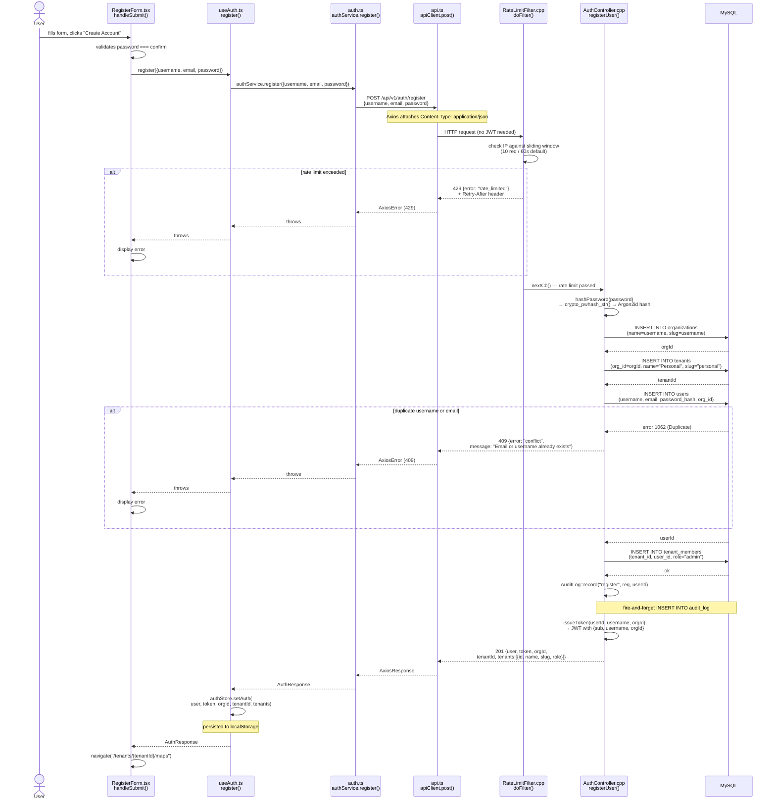

# Flow: User Registration

```mermaid
sequenceDiagram
    actor User
    participant RF as RegisterForm.tsx<br/>handleSubmit()
    participant UH as useAuth.ts<br/>register()
    participant AS as auth.ts<br/>authService.register()
    participant AX as api.ts<br/>apiClient.post()
    participant RL as RateLimitFilter.cpp<br/>doFilter()
    participant AC as AuthController.cpp<br/>registerUser()
    participant DB as MySQL

    User->>RF: fills form, clicks "Create Account"
    RF->>RF: validates password === confirm

    RF->>UH: register({username, email, password})
    UH->>AS: authService.register({username, email, password})
    AS->>AX: POST /api/v1/auth/register<br/>{username, email, password}

    Note over AX: Axios attaches Content-Type: application/json

    AX->>RL: HTTP request (no JWT needed)
    RL->>RL: check IP against sliding window<br/>(10 req / 60s default)
    alt rate limit exceeded
        RL-->>AX: 429 {error: "rate_limited"}<br/>+ Retry-After header
        AX-->>AS: AxiosError (429)
        AS-->>UH: throws
        UH-->>RF: throws
        RF->>RF: display error
    end
    RL->>AC: nextCb() — rate limit passed

    AC->>AC: hashPassword(password)<br/>→ crypto_pwhash_str() → Argon2id hash

    AC->>DB: INSERT INTO organizations<br/>(name=username, slug=username)
    DB-->>AC: orgId

    AC->>DB: INSERT INTO tenants<br/>(org_id=orgId, name="Personal", slug="personal")
    DB-->>AC: tenantId

    AC->>DB: INSERT INTO users<br/>(username, email, password_hash, org_id)
    alt duplicate username or email
        DB-->>AC: error 1062 (Duplicate)
        AC-->>AX: 409 {error: "conflict",<br/>message: "Email or username already exists"}
        AX-->>AS: AxiosError (409)
        AS-->>UH: throws
        UH-->>RF: throws
        RF->>RF: display error
    end
    DB-->>AC: userId

    AC->>DB: INSERT INTO tenant_members<br/>(tenant_id, user_id, role="admin")
    DB-->>AC: ok

    AC->>AC: AuditLog::record("register", req, userId)
    Note over AC,DB: fire-and-forget INSERT INTO audit_log

    AC->>AC: issueToken(userId, username, orgId)<br/>→ JWT with {sub, username, orgId}

    AC-->>AX: 201 {user, token, orgId,<br/>tenantId, tenants:[{id, name, slug, role}]}
    AX-->>AS: AxiosResponse
    AS-->>UH: AuthResponse

    UH->>UH: authStore.setAuth(<br/>user, token, orgId, tenantId, tenants)
    Note over UH: persisted to localStorage

    UH-->>RF: AuthResponse
    RF->>RF: navigate("/tenants/{tenantId}/maps")
```
